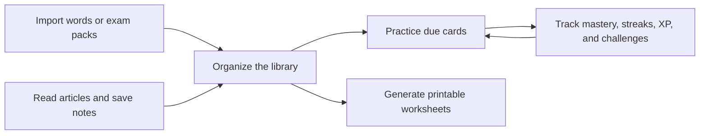

# Flashcard Studio

<p align="center">
  
</p>

<p align="center">
  <strong>A focused study workspace for vocabulary, reading practice, worksheets, and spaced-repetition review.</strong>
</p>

<p align="center">
  <a href="https://github.com/erichuang1425/flashcard/blob/main/LICENSE"></a>
  
  
  
  
</p>

Flashcard Studio helps learners turn vocabulary lists, exam packs, and reading
material into repeatable practice. Import a deck, organize it by category,
review it in several active-recall modes, save notes from articles, and print
worksheets when paper is easier than another tab.

The project is a working React + Firebase app, not a static mockup. It includes
authentication, Firestore-backed user data, offline caching, built-in SAT, PTE
Academic, and TOEFL iBT vocabulary packs, export tools, and tests around the
learning logic and data boundaries.

**Live app:** [vocabmaster1425.web.app](https://vocabmaster1425.web.app)

## What you can do

| Product layer | What is implemented |
| --- | --- |
| Study loop | Flashcards, multiple choice, fill-in-the-blanks, matching, and crossword-style fill-in puzzles |
| Learning memory | SM-2 style scheduling helpers, mastery tracking, due-card counts, streaks, XP, achievements, and daily challenges |
| Content pipeline | Manual entry, CSV import, reviewer sample data, built-in SAT, PTE Academic, and TOEFL iBT packs |
| Reading practice | Article import, reading progress, notes, dictionary lookup, and save-to-flashcards flow |
| Output tools | Printable worksheet generation plus PDF, Word, and flashcard exports |
| Platform depth | Firebase Authentication, Firestore, Storage, PWA metadata, and offline local cache |

## Product map



## Screenshots

Screenshots are not committed yet because the UI is still moving. These are the
views worth capturing once the next visual pass lands:

| Library | Study session | Reading workspace |
| --- | --- | --- |
| Searchable cards, categories, and bulk actions | Flashcard review plus active-recall modes | Article notes, dictionary lookup, and save-to-card flow |

## Tech stack

| Area | Tools |
| --- | --- |
| App | React 18, TypeScript, Vite |
| UI | Material UI, Framer Motion |
| Routing | React Router |
| Backend | Firebase Authentication, Firestore, Storage |
| Offline | Service worker, Firestore persistent local cache |
| Documents | pdfmake, jsPDF, docx |
| Tests | Jest, Testing Library, ts-jest, Firebase rules emulator |

## Setup

### Prerequisites

- Node.js 20+
- npm 10+
- A Firebase project with Authentication, Firestore, and Storage enabled
- Java, only for the Firestore emulator rule tests

### Configure

Copy the example environment file and add your Firebase web app values:

```bash
cp .env.example .env
```

The app reads these Vite environment keys:

```text
REACT_APP_FIREBASE_API_KEY
REACT_APP_FIREBASE_AUTH_DOMAIN
REACT_APP_FIREBASE_PROJECT_ID
REACT_APP_FIREBASE_STORAGE_BUCKET
REACT_APP_FIREBASE_MESSAGING_SENDER_ID
REACT_APP_FIREBASE_APP_ID
```

### Install and run

```bash
npm install
npm run dev
```

Vite will print the local URL, usually `http://localhost:5173`.

## Usage

Use this path to see the main product loop in about 10 minutes:

1. Sign in with a Firebase-backed account.
2. Open Import and upload `sample-data/flashcards-sample.csv`, or import a
   built-in SAT, PTE Academic, or TOEFL iBT pack.
3. Assign a category such as `exam-prep` or `business-english`.
4. Open Library and confirm the new cards are searchable and grouped.
5. Start a Study session and try flashcards plus one active-recall mode.
6. Check progress, XP, challenge, and streak feedback after review.
7. Open Reading, import an article, save a note, and add a looked-up word to the
   flashcard library.

## Scripts

```bash
npm run dev        # Start the Vite development server
npm run build      # Type-check and build production assets
npm run preview    # Preview the production build locally
npm run test       # Run the default Jest suite
npm run test:rules # Run Firestore rule tests through Firebase emulators
npm run typecheck  # Type-check without emitting files
```

## Project structure

```text
src/
  components/        Reusable UI and feature components
  context/           App providers for auth, settings, study state, and i18n
  hooks/             Custom React hooks
  i18n/              English and Traditional Chinese translations
  pages/             Route-level product experiences
  services/          Firebase and domain service boundaries
  theme/             Theme tokens and mobile styling
  types/             Shared TypeScript models
  utils/             Learning, import, speech, viewport, and text helpers

public/              PWA assets and built-in vocabulary CSV packs
sample-data/         Small CSV for reviewer import testing
docs/                Case study, release notes, auth notes, and test analysis
scripts/             Local development helpers
```

## Testing

- Jest coverage for study-mode logic, spaced repetition, crossword generation,
  CSV parsing, i18n, auth persistence, settings, gamification, reading services,
  worksheet exports, and Firestore rules.
- Firebase security rules keep user-owned flashcards, articles, worksheets,
  diary entries, preferences, and progress under each user's subtree.

Run the default suite:

```bash
npm run test
```

Run Firestore rule tests when the Firebase emulator is available:

```bash
npm run test:rules
```

See `docs/TEST_COVERAGE_ANALYSIS.md` for the current coverage map and remaining
test priorities.

## Deployment

The repository includes Firebase Hosting and security-rule configuration:

- `firebase.json`
- `.firebaserc`
- `firestore.rules`
- `firestore.indexes.json`
- `storage.rules`

Build before deploying:

```bash
npm run build
```

Then deploy from an authenticated Firebase CLI session:

```bash
firebase deploy
```

The configured hosting target is `vocabmaster1425`. Confirm the active Firebase
project before publishing changes to the live site.

## Documentation

- `docs/CASE_STUDY.md` explains the product decisions and tradeoffs.
- `docs/RELEASE_NOTES.md` contains the public v1.0.0 release notes.
- `docs/AUTH_PERSISTENCE.md` documents the sign-in persistence contract.
- `docs/TEST_COVERAGE_ANALYSIS.md` tracks coverage and remaining test priorities.
- `docs/core-features-redesign-plan.md` captures deeper architecture planning.

## Roadmap

- Add route-level code splitting for faster first load.
- Add an import validation report with row-level error export.
- Capture polished screenshots after the next UI pass.
- Expand route-level tests for Login, Register, Study, Import, Library, and Reading workflows.
- Add a review scheduling dashboard with calendar-style visibility.
- Explore optional shared decks after personal-deck flows are fully hardened.

## License

Flashcard Studio is available under the ISC License. See `LICENSE` for details.
